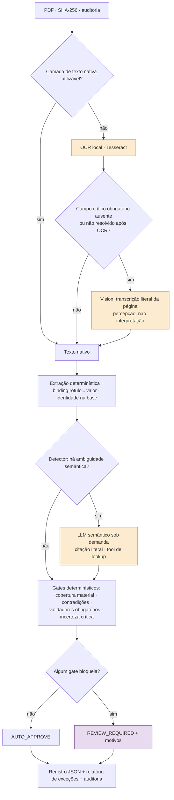

# Corporate Actions — avisos de eventos corporativos em registros validados

Technical case: AI Developer, Asset Servicing.

O sistema lê avisos de eventos corporativos em PDF (dividendos, JCP, bonificação, desdobramento, grupamento) e gera um
registro estruturado por documento. Cada valor vem com a evidência literal de onde foi lido, e o registro é validado contra
uma base de referência. A decisão final é explícita: **AUTO_APPROVE** ou **REVIEW_REQUIRED**, com os motivos. A IA entra só
onde há ambiguidade de leitura ou de interpretação. Validação e decisão são código determinístico.

---

## Problema

- Os avisos chegam em formatos heterogêneos: tabelas, texto corrido, terminologia variável, datas por extenso, scans sem
  camada de texto.
- Deles sai um registro que alimenta cálculo de provento, custódia e conciliação. Um valor errado aprovado
  automaticamente tem custo financeiro e regulatório.
- **Os erros não custam o mesmo.** Uma aprovação errada é pior que uma revisão desnecessária: a revisão custa tempo de
  operador; a aprovação errada propaga um valor falso. O sistema foi desenhado para errar para o lado da revisão.

## Princípios de desenho

1. **Problema primeiro, não IA primeiro.** Cada componente de IA entrou só depois de um experimento mostrar a falha
   concreta que ele resolve.
2. **Determinístico quando possível.** Hash, parsing, lookup na base, identidade, aritmética, datas, campos obrigatórios e
   roteamento são código.
3. **LLM só para ambiguidade semântica**, e só quando um detector determinístico diz que é necessário.
4. **Percepção separada de interpretação.** OCR e vision só transformam imagem em texto. Interpretar é papel do LLM
   semântico. Validar e decidir é papel do código.
5. **Validação determinística obrigatória.** Nenhuma aprovação depende só da resposta de um modelo.
6. **Incerteza explícita.** Ausente continua ausente; pendente ("a definir") é registrado como pendente; nada é
   completado ou corrigido em silêncio.
7. **Revisão humana para risco não resolvido**, sempre com motivo codificado.
8. **Auditabilidade desde o início.** Cada valor e cada decisão podem ser reconstruídos a partir do registro.

## Arquitetura final



- **Caminho rápido** (texto nativo, sem ambiguidade): só código, em milissegundos.
- **Vision ≠ LLM semântico.** São papéis distintos, com logs e custos separados no registro. Mesmo quando usam o mesmo
  modelo, o vision só transcreve (sem dados de referência, sem ferramentas) e o LLM semântico só interpreta trechos citados.
- **O código valida e decide** em todos os caminhos.

## Por que não IA em tudo?

| Determinístico (código) | Onde a IA entra |
|---|---|
| SHA-256 do documento, leitura da camada de texto | Classificação do evento quando o texto é ambíguo ou descreve o evento sem o nome canônico |
| Extração por rótulo e padrão, com binding conservador rótulo→valor | Papéis de datas redigidos de forma heterogênea ("farão jus os acionistas posicionados em…") |
| Lookup exato na base de referência e resolução de identidade | Qualificadores: condições, exceções e o que é contexto operacional × informação material |
| Aritmética `Decimal` (bruto × (1 − alíquota) = líquido) | Ambiguidade semântica que as regras não resolvem |
| Consistência de datas, campos obrigatórios, pendências | Vision, apenas para um scan em que o OCR local não recupera um campo crítico obrigatório |
| Cobertura material, contradições, incerteza, gates de roteamento | — |

Tudo o que tem resposta verificável por regra fica em código: é mais barato, reproduzível e auditável, e não alucina.

## Estratégia de percepção

1. **Texto nativo primeiro.** Se a camada de texto do PDF é utilizável, OCR e vision não são chamados.
2. **OCR local** (Tesseract 5.4, modelo `por`, 300 DPI), só quando não há camada de texto utilizável. A decisão vem da
   leitura do PDF, nunca do nome do arquivo.
3. **Vision como fallback secundário.** Uma sondagem determinística do texto do OCR, sem LLM, verifica se algum campo
   crítico obrigatório ficou ausente, com valores divergentes, com identidade não resolvida ou com tipo de evento
   indeterminado. Só nesse caso o vision gera uma **nova transcrição completa**.
   - A pipeline usa OCR **ou** vision, nunca uma mistura campo a campo. O OCR fica guardado como evidência operacional.
   - Confiança baixa do OCR ou "ser scan" não bastam para chamar vision.
4. **Incerteza declarada pela percepção.** Um campo crítico que o vision marcou como incerto só segue se uma fonte
   determinística **independente** confirmar o valor exato; caso contrário, vai para revisão. Exemplo: a linha da base
   encontrada por outro identificador. Confiança do próprio modelo, normalização do próprio valor ou lookup circular não
   contam como confirmação.

| | OCR local | Vision |
|---|---|---|
| Onde roda | na máquina; o documento não sai | serviço externo: **a imagem da página é enviada ao provedor** |
| Custo marginal | zero | ~US$ 0,05 por página |
| Latência (doc 07) | ~4 s | ~8–10 s |
| Qualidade no doc 07 | todos os números financeiros exatos; ticker lido errado ("TLNR4" → "TLNRA"), sem aprovar valor errado | 11/11 campos críticos exatos, estável em 3 chamadas |
| Uso em produção | livre | **depende de aprovação de governança de dados** (ver abaixo) |

## LLM semântico

- Chamado **apenas** pelo detector de necessidade (sinais determinísticos: papel de data obrigatório não mapeado,
  qualificador não interpretado, conflito de sinais de evento, contradição). No case original: 1 de 8 documentos.
- Toda citação do modelo precisa ser localizada literalmente no texto, e o valor precisa estar dentro da citação. Citação
  que não se localiza é descartada.
- Function calling real: o modelo consulta a base de referência por uma tool determinística. Mesmo assim, o orquestrador
  roda **todas** as validações obrigatórias; a segurança não depende de o modelo decidir chamar a tool.
- Saída estruturada com schema, fallback de modelo desligado, prompt versionado por fingerprint, respostas em cache para
  reprodução.
- **O modelo nunca decide a aprovação.** Ele propõe interpretações; a fusão é determinística, e os gates decidem.

## Validação e segurança

- **Definição de aprovação insegura** usada na avaliação final: um AUTO_APPROVE com qualquer um destes problemas:
  - campo alucinado ou valor diferente do gabarito;
  - ambiguidade material aprovada;
  - falha de validação aprovada;
  - **omissão de informação material**;
  - contradição semântica aprovada.
- **Omissão material.** Toda informação material detectada no documento precisa estar representada no registro,
  explicitamente não resolvida ou justificada como não aplicável. Senão: `MATERIAL_INFORMATION_NOT_REPRESENTED`.
  Exemplos: uma isenção de IR, uma data de crédito, uma revogação.
- **Tratamento tributário explícito:** alíquota, isenção, sem retenção, múltiplas alíquotas, exceções por beneficiário.
  Isenção nunca vira "0%".
- **Contradições determinísticas:** tipo de evento × tributação, direção da proporção × tipo, isenção × alíquota.
  Revogação de evento anterior → revisão.
- **Precisão:** toda aritmética em `Decimal` construído da string do documento. A comparação calculado × declarado usa a
  precisão declarada, sem arredondamento inventado.
- **Nada é inventado:** campo ausente fica `not_found`, pendente fica `declared_pending`, e a base de referência nunca
  preenche campo extraído.
- **Binding conservador:** um rótulo só se associa a um valor se não houver outro campo, fim de frase ou anotação do
  valor anterior no caminho. Pontilhado de tabela é tratado como preenchimento. Na dúvida, o campo fica ausente e vai
  para revisão.
- **Falha técnica = revisão.** OCR indisponível, vision fora do ar, LLM sem resposta ou saída malformada nunca levam a
  aprovação.

## Resolução de identidade

1. **ISIN exato** na base. ISIN presente e ausente da base → `REFERENCE_NOT_FOUND`, sem tentar outro identificador.
2. Sem ISIN: **ticker exato + CNPJ exato** na mesma linha da base.
3. Sem ISIN e sem CNPJ: **ticker exato + razão social exata** (normalizada só por espaços e caixa).
4. Qualquer outro caso → **não resolvido → revisão**: ticker sozinho, nome parecido, ticker em mais de uma linha,
   identificadores em conflito.

Não há fuzzy matching: identidade errada é o pior erro possível num registro de evento.

## Auditabilidade

Cada registro guarda:
- `run_id`, SHA-256 do documento e nome do arquivo (só como metadado), versão da pipeline, horários;
- caminho de percepção e o motivo do fallback; motor e versão do OCR; modelo e fingerprint do prompt do vision;
- chamadas do LLM semântico: gatilhos, tool calls, citações e resultado da verificação;
- evidência literal por campo, com posições no texto e página; decisões de binding;
- identidade e linha da base usada; todas as validações, com valores observados;
- cobertura material, contradições, incerteza e confirmações;
- motivos de roteamento por gate;
- latência por etapa, tokens, custo estimado e erros.

Segredos não são registrados, e o texto integral do documento não vai para logs gerais.

## Resultados no case fornecido

Run final da solução (`outputs/experiments/E-011_final_integration/final_run`), com os 8 PDFs do case:

| Doc | Percepção | LLM semântico | Roteamento | Motivo principal |
|---|---|---|---|---|
| 01 Energética — dividendo | texto nativo | não | AUTO_APPROVE | completo, referência e regras aprovadas |
| 02 Banco Meridional — JCP | texto nativo | não | AUTO_APPROVE | completo; líquido = bruto × (1 − 17,5%) exato |
| 03 Siderúrgica — "Dividendos" com conteúdo de JCP | texto nativo | não | REVIEW | `CLASSIFICATION_TITLE_CONFLICT` |
| 04 Rede Varejo — JCP | texto nativo | não | REVIEW | `PAYMENT_DATE_PENDING` (data "a definir") |
| 05 Aurora — dividendo | texto nativo | não | REVIEW | `DATE_INCONSISTENCY` (pagamento antes da data ex) |
| 06 Petroquímica — grupamento | texto nativo | **sim** | REVIEW | `REQUIRED_FIELD_MISSING`: data ex não confirmada |
| 07 Telecom Norte — JCP escaneado | **OCR → vision** | não | AUTO_APPROVE | ticker ausente após OCR → vision; 13/13 campos e 17/17 validações |
| 08 Construtora — bonificação | texto nativo | não | REVIEW | `REFERENCE_NOT_FOUND` (ativo fora da base) |

- 7 documentos por texto nativo e 1 por OCR → vision. 3 aprovações automáticas e 5 revisões.
- **0 aprovações inseguras, 0 omissões materiais aprovadas, 0 bindings errados, 0 aprovações com identidade errada.**
- Contra o gabarito manual: roteamento correto em 5 de 6 casos com expectativa definida. O desvio é o doc 06: revisão
  desnecessária, porque o LLM citou a data ex sem o valor dentro da citação e o grounding a rejeitou.
- O gabarito do doc 07 não fixa a decisão ("depende da política de percepção"). Ele aceita AUTO_APPROVE quando todos os
  campos têm evidência e as checagens passam, que é o caso.
- **Custo:** US$ 0,1195 no lote, ~US$ 0,015 por documento (vision US$ 0,045 no doc 07; LLM semântico US$ 0,074 no
  doc 06).
- **Latência:** 26,2 s no lote. Documentos nativos sem LLM levam 14–56 ms; o doc 07 levou 12,0 s e o doc 06, 14,0 s.
  Os caminhos caros só rodam quando necessários.

Estas proporções descrevem o lote do case (8 documentos), não uma distribuição de produção.

## Como avaliamos

Cada etapa teve hipótese registrada, configuração congelada antes da execução e critérios definidos antes de ver os
resultados. Detalhes, números e erratas estão em [docs/04-evaluation-log.md](docs/04-evaluation-log.md).

- **Baseline determinístico.** Resolveu 95% dos valores nos PDFs com texto sem inventar nada. Mas aprovou em silêncio uma
  alíquota condicional ("10% sobre a parcela que exceder R$ 50.000") como se fosse fixa: um erro semântico que regra não
  vê.
- **LLM sempre ligado.** Generalizou melhor em linguagem heterogênea (21/21 alvos semânticos num conjunto de desafio
  contra 10/21 das regras), com custo e latência em todo documento e alarmes falsos de qualificador.
- **LLM sob demanda.** O detector chamou o LLM em 1 de 7 documentos do case (−82% de custo), sem perder segurança. Um
  modelo mais estrito de qualificadores reduziu revisões desnecessárias no conjunto de desafio de 5/11 para 2/11.
- **Blind tests.** Um conjunto criado por processo independente revelou um registro aprovado **sem** a isenção de IR
  declarada. Isso levou a tratar omissão material como falha de segurança, a modelar tratamento tributário e a criar o
  gate de cobertura. Um segundo blind test, independente do desenvolvimento, mostrou o sistema seguro mas conservador
  demais: 0/4 aprovações corretas, todas bloqueadas por exigir ISIN. Isso levou à identidade hierárquica e ao binding
  conservador.
- **Percepção.** No doc 07, o OCR local foi seguro, mas perdeu o ticker. O vision recuperou os 11 campos críticos, com
  leitura idêntica em execuções independentes. Daí o desenho OCR → vision só quando falta campo crítico, mais a política
  de incerteza.

Os conjuntos sintéticos (desafio e blind tests) serviram para expor failure modes e testar invariantes. **Não medem
prevalência em produção.**

## Testes

- **1.287 testes passando** (mais 4 `xfail` que documentam limites conhecidos do baseline), em ~12 s, sem rede.
- Categorias:
  - unidades determinísticas (Decimal, datas, validação, referência, identidade, binding, incerteza);
  - comportamento semântico com provedor falso;
  - roteamento de percepção e falhas seguras com OCR e vision falsos;
  - fumaça do OCR real (pulado sem Tesseract);
  - integridade dos gabaritos e dos conjuntos de teste.
- **Freezes e replays:** cada configuração avaliada tem hashes congelados, e testes de replay reproduzem os registros
  oficiais a partir das respostas de LLM gravadas. Mudanças posteriores não alteram resultados históricos em silêncio.
- Quantidade de testes não é medida de qualidade. Os testes relevantes são os de invariantes de segurança (nada
  inventado, sem binding errado, sem identidade ambígua aprovada, falha técnica → revisão) e os de replay.

## Como rodar

Requer Python ≥ 3.12 (testado com 3.13).

> **Windows:** clone num caminho curto (ex.: `C:\src\btg-case`). Alguns artefatos versionados têm caminho relativo de
> até ~160 caracteres, e caminhos acima de 260 falham no Windows sem suporte a caminhos longos.

```bash
git clone <url-do-repositorio> btg-case && cd btg-case
python -m venv .venv
# Windows: .venv\Scripts\python   ·   Linux/macOS: .venv/bin/python
.venv/Scripts/python -m pip install -r requirements-dev.txt -r requirements-llm.txt
```

Dependências:

| Arquivo | Conteúdo |
|---|---|
| `requirements.txt` | base (`pypdf`) |
| `requirements-ocr.txt` | renderização para OCR e vision (`pypdfium2`, `pillow`) |
| `requirements-llm.txt` | SDK do provedor (`anthropic`) |
| `requirements-dev.txt` | OCR + `pytest` |

**OCR local (opcional; necessário para o doc 07):**

```bash
winget install --id UB-Mannheim.TesseractOCR -e      # Linux: apt install tesseract-ocr · macOS: brew install tesseract
.venv/Scripts/python scripts/setup_ocr.py            # baixa o modelo "por" fixado, confere o SHA-256, copia as configs
```

**Modelos externos (opcional):**

```bash
cp .env.example .env    # preencha ANTHROPIC_API_KEY; o .env é ignorado pelo git
```

**Testes:**

```bash
.venv/Scripts/python -m pytest
```

**Pipeline nos 8 PDFs do case** (o módulo fica em `src/`: defina `PYTHONPATH=src`; no PowerShell,
`$env:PYTHONPATH="src"`):

```bash
# Solução final (com .env): texto nativo -> OCR -> vision quando necessário; LLM semântico sob demanda
PYTHONPATH=src .venv/Scripts/python -m corporate_actions --variant K --out outputs/runs/final

# Reproduzir o run oficial sem chave, sem custo e sem rede, a partir das respostas gravadas.
# O SDK exige uma chave não vazia; a URL aponta para uma porta local fechada, então nenhuma chamada sai da máquina.
F=outputs/experiments/E-011_final_integration/final_run
ANTHROPIC_API_KEY=offline-replay ANTHROPIC_BASE_URL=http://127.0.0.1:9 PYTHONPATH=src \
  .venv/Scripts/python -m corporate_actions --variant K --out outputs/runs/replay --llm-cache $F/llm_cache --vision-cache $F/vision_cache

# Sem nenhuma IA: apenas regras determinísticas (sem OCR/vision/LLM)
PYTHONPATH=src .venv/Scripts/python -m corporate_actions --variant B --out outputs/runs/deterministic
```

Sem `.env`, a variante K roda em modo seguro: o doc 06 (que precisaria do LLM) e o doc 07 (que precisaria do vision) vão
para revisão.

Cada run grava:
- `records/<documento>.json`: um registro por documento;
- `exceptions_report.md`: o que foi para revisão e por quê;
- `run_manifest.json`: versões, hashes, configuração e resumo.

## Saída (trecho real do doc 07)

```json
{
  "schema_version": "corporate-action-record/1.0",
  "document": {"sha256": "cf4af08d…c45f", "file_name": "07_telecom_norte_jcp_SCAN.pdf"},
  "perception": {"path": "VISION_FALLBACK", "fallback_trigger": "NO_USABLE_TEXT_LAYER",
                 "decision": {"ocr_probe_reasons": ["REQUIRED_TICKER_MISSING_AFTER_OCR"]}},
  "fields": {
    "gross_amount_per_share": {
      "status": "found", "value": "0.1124300000", "raw": "0,1124300000",
      "evidence": [{"text": "Valor bruto por ação PN ,,,,,,,,, R$ 0,1124300000", "start": 761, "end": 810, "page": 1}],
      "extraction_rules": ["gross.label_valor_bruto"], "confidence": "HIGH"}
  },
  "validations": [
    {"rule_id": "AMOUNT_NET_MATCHES_GROSS_AND_TAX", "status": "PASS", "message": "net = gross × (1 − rate), exact",
     "observed": {"gross": "0.1124300000", "rate": "0.175", "declared_value": "0.0927547500", "calculated_value": "0.0927547500000"}},
    {"rule_id": "REF_IDENTITY_RESOLVED", "status": "PASS", "message": "identity ISIN_EXACT"}
  ],
  "routing": {"decision": "AUTO_APPROVE", "reason_codes": []},
  "run_summary": {"perception_path": "VISION_FALLBACK", "vision_called": true, "semantic_llm_called": false,
                  "estimated_cost_usd": {"perception": "0.04538", "semantic_llm": "0", "total": "0.04538"}}
}
```

O registro completo também traz tratamento tributário, binding, identidade, cobertura material, contradições,
incerteza, gates de roteamento e auditoria por etapa.

## Estrutura do repositório

```
README.md                 este documento
DECISIONS.md              decisões de arquitetura (com contexto e consequências)
docs/                     entendimento do problema, mapa dos documentos, hipóteses, arquitetura, log de avaliação
case/                     material original do case (somente leitura; SHA-256 em docs/01-document-map.md)
src/corporate_actions/    pipeline: ingestão, extração, binding, identidade, semântica, validação, roteamento, auditoria
src/perception/           OCR local, vision e roteador de percepção
src/evaluation/           avaliadores de cada experimento
tests/                    testes, gabarito manual, conjunto de desafio e blind sets
outputs/experiments/      artefatos de cada experimento (registros, avaliações, caches de LLM)
scripts/setup_ocr.py      preparação do modelo de OCR
```

## Para avaliadores

| O quê | Onde |
|---|---|
| Arquitetura final e trade-off de privacidade | [DECISIONS.md — D-036](DECISIONS.md) |
| Registros do run final dos 8 PDFs | [`outputs/experiments/E-011_final_integration/final_run/`](outputs/experiments/E-011_final_integration/final_run/) (`records/`, `exceptions_report.md`) |
| Métricas do run final | [`final_run/evaluation/e011_final.json`](outputs/experiments/E-011_final_integration/final_run/evaluation/e011_final.json) |
| Gabarito manual do case | [`tests/ground_truth/`](tests/ground_truth/) |
| Log de experimentos (hipóteses, protocolos, resultados, erratas) | [docs/04-evaluation-log.md](docs/04-evaluation-log.md) |
| Hipóteses e status | [docs/02-hypotheses.md](docs/02-hypotheses.md) |
| Entendimento do problema e mapa dos documentos | [docs/00-problem-understanding.md](docs/00-problem-understanding.md), [docs/01-document-map.md](docs/01-document-map.md) |

## Limitações conhecidas

- **Percepção testada em um único scan real, e limpo** (doc 07). Não há medida em scans degradados. O vision foi
  estável em 3 chamadas nesse documento, o que não é uma taxa de erro.
- **A incerteza autodeclarada pelo vision é instável:** marcou o ISIN como incerto em 2 de 3 chamadas, com os mesmos
  valores lidos. A política de incerteza protege quando há declaração. A segurança de fundo é a validação determinística:
  referência exata, aritmética, ordem de datas.
- Uma leitura errada feita com confiança, sem declaração de incerteza, só é pega se violar uma validação. A confiança
  do Tesseract não detectou "TLNR4" → "TLNRA" (confiança 84).
- Documentos válidos podem ir para revisão. O sistema é conservador por desenho, e o doc 06 é o exemplo no case.
- Os conjuntos sintéticos testam failure modes, não prevalência.
- O uso de vision (serviço externo) depende de aprovação de governança de dados.
- O schema cobre dividendos, JCP, bonificação, desdobramento e grupamento. Outros eventos, como cisão ou subscrição, vão
  para revisão como não suportados; revogação é detectada e revisada, não modelada.
- Sem chave de API, a falha do LLM semântico aparece como `PROCESSING_ERROR`, e não como o motivo mais específico
  `SEMANTIC_INTERPRETER_FAILED`. O desfecho (revisão) é o correto.
- O avaliador herdado da fase de hardening rotula a expectativa "dependente de política" do doc 07 como "revisão
  esperada". Isso não afeta a métrica de segurança.
- O prefixo de versão `baseline-a/0.1.0+…` é histórico: a versão efetiva da solução é o sufixo `final-integrated/1.0`.
- Não há nenhuma afirmação de prontidão para produção em escala bancária.

## Considerações para produção

- Modelo e provedor aprovados, com contrato, retenção, residência de dados e confidencialidade definidos. Sem aprovação,
  operar só com OCR local e mandar para revisão o que precisaria de vision (comportamento já suportado).
- Segredos num cofre, não em `.env`.
- Trilha de auditoria em armazenamento persistente e imutável; observabilidade (métricas por gate, custo, latência,
  taxa de revisão).
- Processamento assíncrono e filas, se o volume justificar; rate limits e retries com backoff.
- Prompts e modelos versionados, com replay de regressão antes de trocar qualquer um.
- Interface de revisão humana que mostre a evidência e o motivo de cada bloqueio.
- Calibração com dados reais de produção: taxa de revisão, falsos alertas, novos layouts. Monitoramento de deriva e
  controle de custo.

## Decisões deliberadamente não tomadas

- **Sem RAG ou vector DB:** a base de referência é uma consulta exata; similaridade semântica não serve para identidade.
- **Sem multi-agent:** o fluxo é linear e verificável; mais agentes não resolveriam nenhuma falha observada.
- **Sem fuzzy match de identidade:** um emissor "parecido" aprovado é o pior erro possível.
- **Sem vision como primeira opção:** custo, latência e envio externo de dados sem ganho onde há texto nativo ou OCR
  suficiente.
- **Sem LLM para cálculos:** aritmética é `Decimal` exato em código.
- **Sem autocorreção de números:** um valor ilegível ou inconsistente vai para revisão, nunca é "consertado".

## Trabalho futuro (por prioridade)

1. Validar a percepção em mais scans reais, principalmente degradados.
2. Fluxo de revisão humana de verdade (fila, evidência lado a lado, decisão registrada).
3. Expandir os schemas de evento conforme a demanda real.
4. Integração com o provedor e a governança aprovados.
5. Monitorar a taxa de revisão desnecessária com dados de produção.
